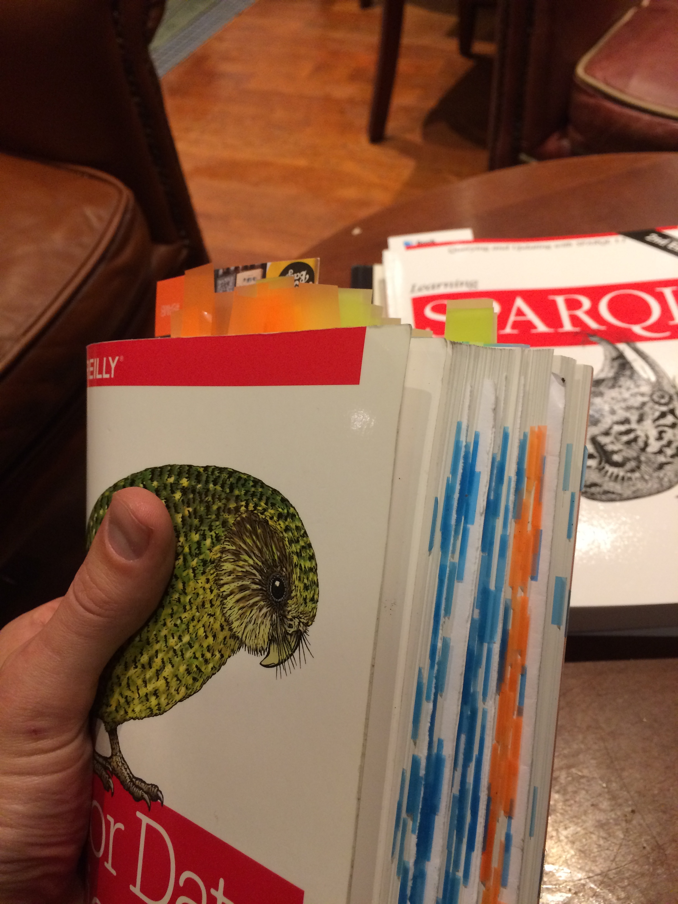

# MOOC : "R for Data Science"
###### 30/12/17 - 20/4/18 (for me)

"The goal of this online community is to provide a friendly and supportive online space for you to work with likeminded people just getting started in data analysis by reading “[**R for Data Science**](http://r4ds.had.co.nz/)”, a free and publicly available book written by Garrett Grolemund and Hadley Wickham" -- Jesse Maegan [20/8/17 blog post](https://medium.com/@kierisi/join-the-r-for-data-science-online-learning-community-842527222ab3)

Files in this repo contain my answers from attempting Exercises in the book, (grouped into Chapters). I've tried to give credit if I borrowed from someone else, or quoted from discussions I had in R4ds Slack. (If I forgot to, it was probably [jrnold](https://jrnold.github.io/r4ds-exercise-solutions/), and thanks/apologies to him)

_Starting again, with existing bookmarks from [R4DS\_0917](https://github.com/mbeveridge/R4DS_0917). (Note: This MOOC refers to the online chapter numbers, which differ from the printed book)_